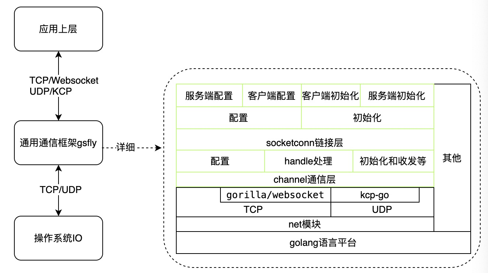

## gsfly
### 简介
**[gsfly](https://github.com/slive/gsfly)** 是轻量级集成tcp、udp、ws(websocket)、kcp，提供高性能和统一的创建，使用通信框架

### 架构
**gsfly** 架构见如下图：

### 依赖
日志相关类：
- [logrus](https://github.com/sirupsen/logrus)
- [lfshook](https://github.com/rifflock/lfshook)
- [file-rotatelogs](https://github.com/lestrrat-go/file-rotatelogs)

kcp相关：
- [kcp-go](https://github.com/xtaci/kcp-go)

websocket相关：
- [gorilla/websocket](https://github.com/gorilla/websocket)

队列集合相关：
- [emirpasic/gods](https://github.com/emirpasic/gods)

